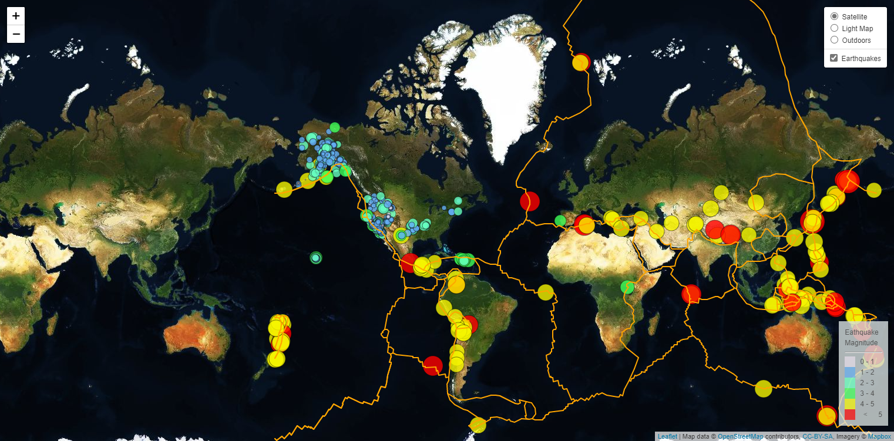

# Leaflet Homework - Visualizing Data with Leaflet

## Background

Welcome to the United States Geological Survey, or USGS for short! The USGS is responsible for providing scientific data about natural hazards, the health of our ecosystems and environment; and the impacts of climate and land-use change. Their scientists develop new methods and tools to supply timely, relevant, and useful information about the Earth and its processes.

The USGS is interested in building a new set of tools that will allow them visualize their earthquake data. They collect a massive amount of data from all over the world each day, but they lack a meaningful way of displaying it. Their hope is that being able to visualize their data will allow them to better educate the public and other government organizations (and hopefully secure more funding..) on issues facing our planet.

This project was accomplished using html, Javascript, and Leaflet.

### Level 1: Basic Visualization - Earthquakes Map

The map was created by using Leaflet that plots all of the earthquakes from the data set based on their longitude and latitude. Data provided by [USGS GeoJSON Feed](http://earthquake.usgs.gov/earthquakes/feed/v1.0/geojson.php) (All Earthquakes from the Past 7 Days).

To view the [JavaScript Code](Leaflet-Step-1/static/js/logic.js)
To view the [HTML code](Leaflet-Step-1/index.html)

### Level 2: Advanced Visualization - Relationship between tectonic plates and seismic activity Map

The map was created with a second data(layer) set to illustrate the relationship between tectonic plates and seismic activity. Data on tectonic plates can be found at https://github.com/fraxen/tectonicplates.

To view the [JavaScript Code](Leaflet-Step-2/static/js/logic.js)
To view the [HTML code](Leaflet-Step-2/index.html)

### Earthquakes Dashboard

This dashboard is deployed public on GitHub page, click the following link to see how it looks like [Earthquakes Dashboard](https://jessicapardo.github.io/Leaflet-challenge/)

### Copyright

© 2021 Trilogy Education Services, LLC, a 2U, Inc. brand. Confidential and Proprietary. All Rights Reserved.